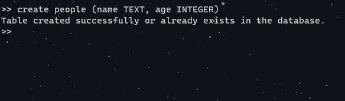
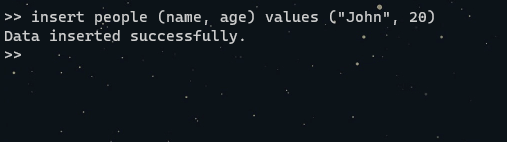
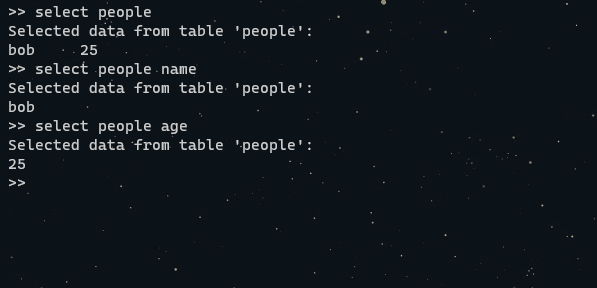
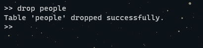

# ConsoleSQLite3

A simple CLI tool to interact with a SQLite3 database.

_Just a little project to learn C++_

## CLI commands

- `help` list all commands
- `clear` clear the console window
- `list` list all tables (Disabled for now as parsing SQL inputs is hard :/)
- `create` create a table
- `insert` insert a row into a table
- `select` select rows from a table
- `drop` delete rows from a table
- `exit` exit the program

## Building:

The project is built for windows and is using vs2022.

After cloning the repo, just build the project. Then run it in visual studio or in the console.

## Usage:

The program will create its own database file in the same directory as the executable.

Run the command below to test the functions:

```sql
create people (name TEXT, age INTEGER)
```



_Please use this syntax as the program will parse out the parenthesis and the comma when running the raw SQL under the hood._

_Also please know this is the only table you can make that will work with the `insert` command as the insert command is not finished yet._

After making the table we can check if it exist by running `list` and we should see the table we just made.


Now we can insert some data into the table by running the command below:

```sql
insert people (name, age) values ("John", 20)
```

_You can omit the all params other than `insert people` as they will not be parsed (yet)_



Next we can view the data we inserted by running:

```sql
select people (name, age)
```

This command grabs all the data from the table and prints it out to the console. If you only pass `select people` it will default to using `*` as the columns. You can also only pass `select people name` to only get the name column, or `select people age` to only get the age column.



Lastly we can drop the table by running:

```sql
drop people
```



## End Note

I hope you enjoyed looking at my first CPP Program. I might continue to work on this project in the future but for now I am happy with what I have learned from it. I've spent a full day working on this and I think im ready to dive a bit deeper but c++ and SQL has been fun indeed! _I could have written this same program in js an hour :D_
